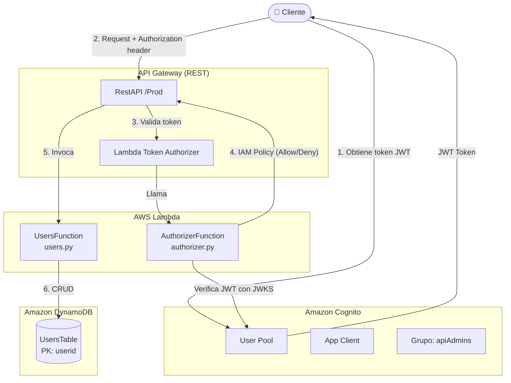
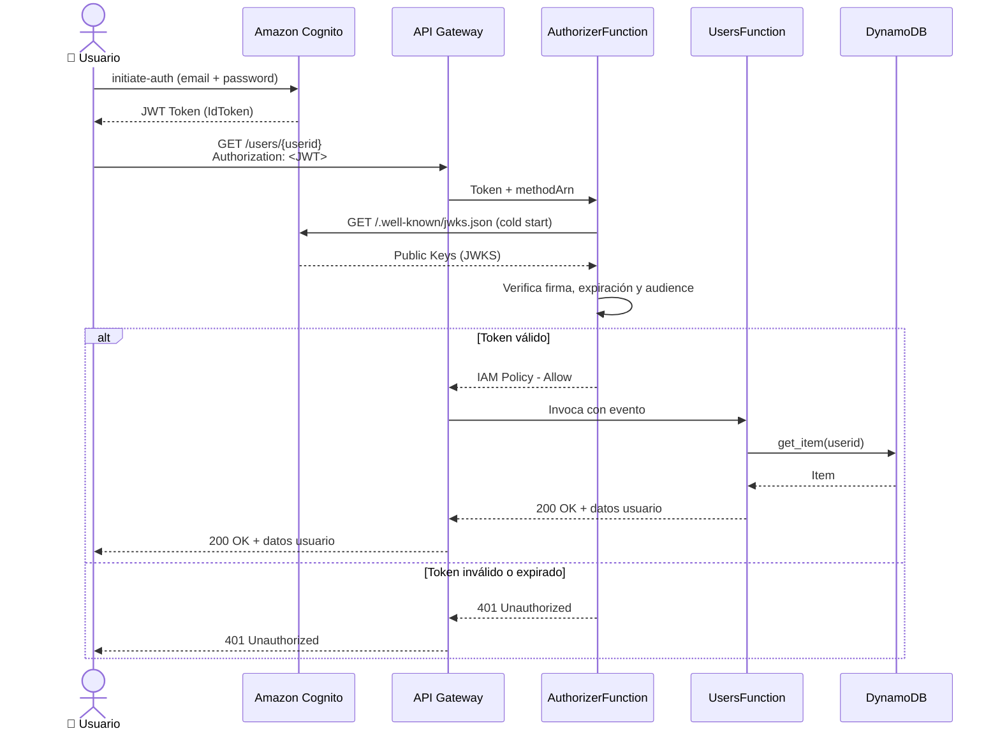
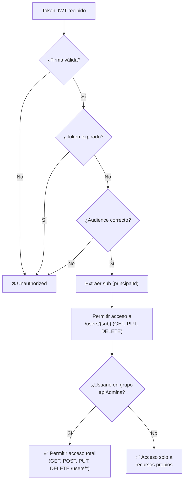

# Serverless Users API

API REST serverless para gestión de usuarios, construida con AWS SAM, Lambda, DynamoDB y autenticación JWT mediante Amazon Cognito.

---

## Arquitectura de Infraestructura



---

## Flujo de Autenticación y Autorización



---

## Flujo de Autorización por Roles



---

## Endpoints de la API

| Método | Ruta | Descripción | Requiere Admin |
|--------|------|-------------|----------------|
| `GET` | `/users` | Lista todos los usuarios | ✅ |
| `POST` | `/users` | Crea un nuevo usuario | ✅ |
| `GET` | `/users/{userid}` | Obtiene un usuario por ID | Solo propio |
| `PUT` | `/users/{userid}` | Actualiza un usuario por ID | Solo propio |
| `DELETE` | `/users/{userid}` | Elimina un usuario por ID | Solo propio |

---

## Estructura del Proyecto

```
users/
├── src/
│   └── api/
│       ├── users.py          # Lambda handler CRUD de usuarios
│       └── authorizer.py     # Lambda authorizer JWT + IAM Policy
├── tests/
│   ├── unit/
│   │   └── test_handler.py
│   └── integration/
│       ├── conftest.py
│       └── test_api.py
├── events/                   # Eventos de prueba para SAM local
├── template.yaml             # SAM template (infraestructura)
├── samconfig.toml            # Configuración de despliegue
└── requirements.txt          # Dependencias Python
```

---

## Requisitos Previos

- [AWS CLI](https://aws.amazon.com/cli/) configurado
- [AWS SAM CLI](https://docs.aws.amazon.com/serverless-application-model/latest/developerguide/install-sam-cli.html)
- Python 3.14
- Permisos IAM para desplegar Lambda, DynamoDB, API Gateway y Cognito

---

## Despliegue

```bash
# 1. Instalar dependencias
pip install -r requirements.txt

# 2. Build
sam build

# 3. Deploy (primera vez, modo guiado)
sam deploy --guided

# 4. Deploys siguientes (usa samconfig.toml)
sam deploy
```

El stack se desplegará en `us-east-2` con el nombre `ws-serverless-patterns-users`.

---

## Prueba Local

```bash
# Iniciar API local
sam local start-api --env-vars env.json

# Ejemplo: obtener todos los usuarios
curl -H "Authorization: <JWT_TOKEN>" http://localhost:3000/users
```

### Obtener un token JWT desde Cognito

```bash
aws cognito-idp initiate-auth \
  --auth-flow USER_PASSWORD_AUTH \
  --client-id <UserPoolClientId> \
  --auth-parameters USERNAME=<email>,PASSWORD=<password> \
  --query 'AuthenticationResult.IdToken' \
  --output text
```

---

## Variables de Entorno

| Variable | Descripción |
|----------|-------------|
| `USERS_TABLE` | Nombre de la tabla DynamoDB |
| `USER_POOL_ID` | ID del Cognito User Pool |
| `APPLICATION_CLIENT_ID` | ID del App Client de Cognito |
| `ADMIN_GROUP_NAME` | Nombre del grupo de administradores (default: `apiAdmins`) |

---

## Recursos AWS Creados

| Recurso | Tipo | Descripción |
|---------|------|-------------|
| `UsersTable` | DynamoDB Table | Almacena datos de usuarios (PK: `userid`) |
| `UsersFunction` | Lambda Function | Maneja operaciones CRUD |
| `AuthorizerFunction` | Lambda Function | Valida JWT y genera políticas IAM |
| `RestAPI` | API Gateway | REST API con authorizer Lambda |
| `UserPool` | Cognito User Pool | Gestión de identidades |
| `UserPoolClient` | Cognito App Client | Cliente con flujo `USER_PASSWORD_AUTH` |
| `UserPoolDomain` | Cognito Domain | Hosted UI para login |
| `ApiAdministratorsUserPoolGroup` | Cognito Group | Grupo con privilegios de administrador |

---

## Dependencias

```
python-jose[cryptography]  # Validación de tokens JWT
```

---

## Licencia

MIT-0 — Ver [LICENSE](https://github.com/aws/mit-0) para más detalles.
